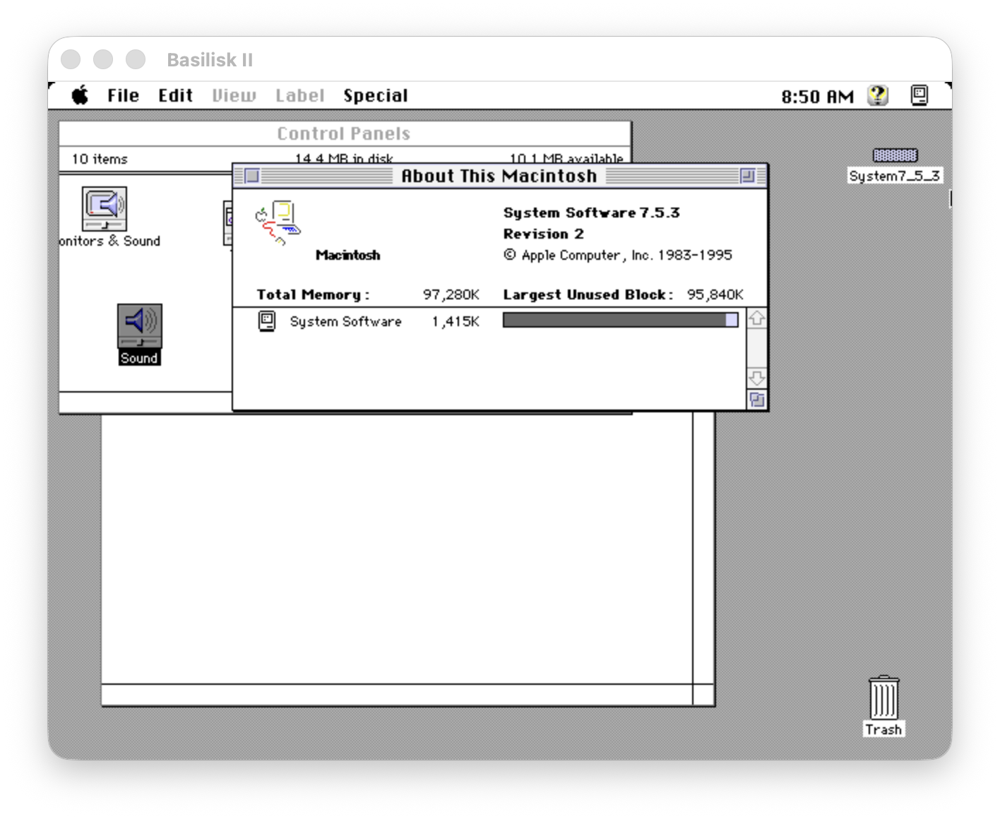
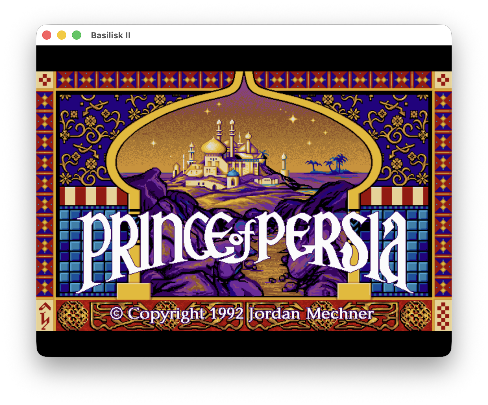

# Basilisk II ARM - For Modern Macs



Modernized 68k Macintosh emulator for Apple Silicon Macs. This version has been updated to compile and run on modern macOS with Apple Silicon (M1/M2/M3) processors.

## What's New

- Apple Silicon Support: Fully compatible with M1, M2, and M3 Macs
- Modern Xcode Project: Updated to use latest Xcode toolchain
- SDL2 Integration: Uses Homebrew's SDL2 for audio and video
- ARM64 Native: Runs natively on ARM architecture (no Rosetta required)

## Prerequisites

### Required Software

1. **Xcode** (latest version from Mac App Store)
2. **Command Line Tools**:
   ```bash
   xcode-select --install
   ```
3. **Homebrew**: Install from [brew.sh](https://brew.sh)
4. **SDL2**:
   ```bash
   brew install sdl2
   ```

### ROM File

You need a Macintosh ROM file to run the emulator:
- Supported: Macintosh II, Quadra, Centris, Performa ROMs (512KB)
- Classic ROMs (256KB) also supported
- Any filename is acceptable - just specify the path in preferences

## Compilation

### Using Xcode GUI

1. Open the project:
   ```bash
   open src/MacOSX/BasiliskII.xcodeproj
   ```

2. Select **BasiliskII** target
3. Choose **Debug** or **Release** configuration
4. Click **Build** (⌘+B)

### Using Command Line

```bash
# Build Debug version
xcodebuild -project src/MacOSX/BasiliskII.xcodeproj -scheme BasiliskII -configuration Debug build

# Build Release version
xcodebuild -project src/MacOSX/BasiliskII.xcodeproj -scheme BasiliskII -configuration Release build
```

The built application will be in:
- `Build/Debug/BasiliskII.app` (Debug)
- `Build/Release/BasiliskII.app` (Release)

## Quick Start

### 1. Preferences Setup

You need to manually create the preferences file at:
`~/.basilisk_ii_prefs`

Create this file with the following default content:

```ini
# Required
rom /path/to/from_your_old_mac/MAC.ROM
ramsize 134217728          # 128MB RAM
bootdrive 0
bootdriver 0

# Disk/Folder (Optional)
# HFS/HFV disk images
disk /path/to/System7.5.img
disk /path/to/Games.img
#disk /path/to/OregonTrail.img

# Host folder sharing
# extfs /path/to/Shared

# Video/Audio
screen win/640/480/8       # 640x480, 8-bit color
frameskip 0
nosound false

# Network (disabled by default)
nonet true

# Serial ports
seriala /dev/null
serialb /dev/null
```

### 2. ROM File Path

Update the ROM path in your preferences file to point to your actual Macintosh ROM file:
```ini
rom /path/to/from_your_old_mac/MAC.ROM
```

### 3. Run the Emulator

```bash
# Command line
./Build/Debug/BasiliskII.app/Contents/MacOS/BasiliskII

# Or GUI
open Build/Debug/BasiliskII.app
```



Classic games like Prince of Persia run perfectly with smooth graphics and sound on Apple Silicon Macs.

## Configuration

### Default Preferences

The preferences file should include:

```ini
# Required
rom /path/to/from_your_old_mac/MAC.ROM
ramsize 134217728          # 128MB RAM
bootdrive 0
bootdriver 0

# Disk/Folder (Optional)
# HFS/HFV disk images
disk /path/to/System7.5.img
disk /path/to/Games.img
#disk /path/to/OregonTrail.img

# Host folder sharing
# extfs /path/to/Shared

# Video/Audio
screen win/640/480/8       # 640x480, 8-bit color
frameskip 0
nosound false

# Network (disabled by default)
nonet true

# Serial ports
seriala /dev/null
serialb /dev/null
```

### Customizing Preferences

Edit `~/.basilisk_ii_prefs` to modify settings:

#### Memory Configuration
```ini
ramsize 268435456          # 256MB RAM
```

#### Video Settings
```ini
screen win/800/600/16      # 800x600, 16-bit color
screen win/1024/768/32     # 1024x768, 32-bit color
```

#### Disk Images
```ini
# Add HFS disk images
disk /path/to/System7.5.img
disk /path/to/Games.img
```

#### Shared Folders
```ini
# Share host folder with emulated Mac
extfs /Users/ay5/Documents/Shared
```

## Disk Images

### Supported Formats
- `.img` - HFS disk images
- `.hfv` - Macintosh disk images
- `.dsk` - Generic disk images

### Common Sizes
- **System Disk**: 500MB - 1GB (for System 7.x)
- **Games Disk**: 100MB - 500MB
- **Documents Disk**: 100MB - 1GB

## Troubleshooting

### Common Issues

#### "ERROR: Cannot open ROM file."
- Check the ROM file path in preferences
- Verify the file exists and is accessible
- Check file permissions

#### "ERROR: Unsupported ROM type."
- Use supported ROM (Mac II, Quadra, Centris, Performa)
- Verify ROM file integrity
- Check file size (256KB or 512KB expected)

#### Build Errors
```bash
# Clean and rebuild
xcodebuild clean
xcodebuild -project src/MacOSX/BasiliskII.xcodeproj -scheme BasiliskII build
```

#### SDL2 Issues
```bash
# Reinstall SDL2
brew reinstall sdl2
```

### Performance Issues

1. **Increase RAM allocation** in preferences
2. **Use Release build** instead of Debug
3. **Close other applications** to free memory
4. **Try lower resolution** or color depth

## License

This project maintains the original Basilisk II license. See `COPYING` for details.

---

**Note**: This is a modernized fork of the original Basilisk II for Apple Silicon Macs. Performance and compatibility may vary depending on your specific hardware and ROM configuration.
